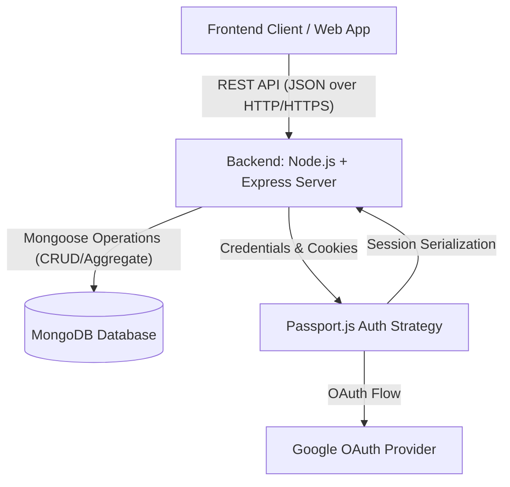
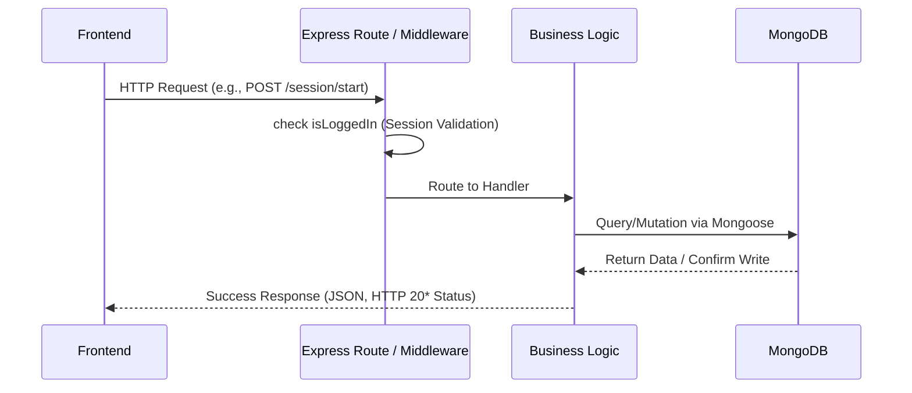
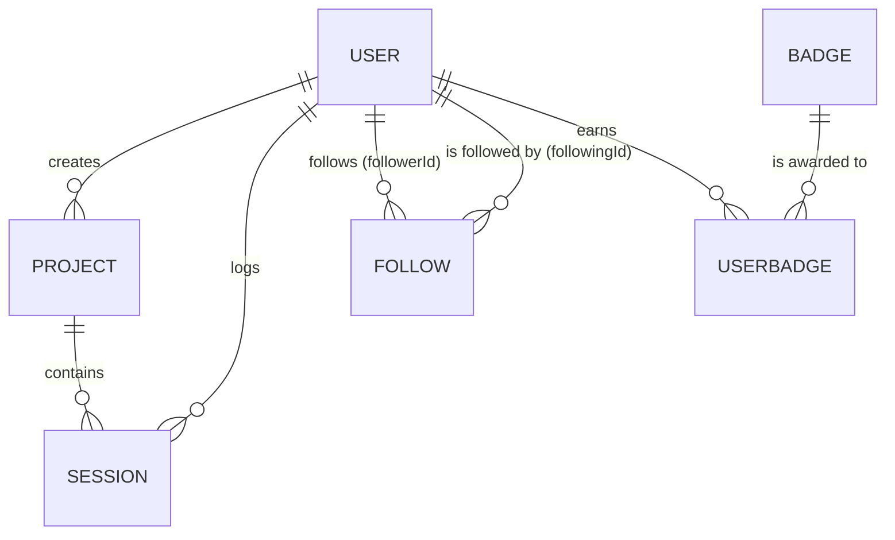

# Strava Clone Backend API & Architecture Documentation

## 1. Overall System Overview

The Strava Clone Backend is a robust REST API designed to support a productivity and focus-tracking application. It handles user authentication, session timing, project organization, social features (following), and a gamified badge system. 

### Main Modules:
* **Auth**: Handles user registration, local login, and Google OAuth via Passport.js, managing sessions using cookies.
* **Profile**: Allows users to manage their personal information and view public profiles of other users, including their focus history.
* **Projects**: Enables categorization of focus sessions. Users can create, update, fetch, and soft-delete projects.
* **Sessions**: The core tracking engine. Users can start, stop, and review focus sessions linked to specific projects.
* **Stats**: An aggregation layer that runs complex MongoDB pipelines to summarize focus time, daily trends, project-wise stats, and streaks.
* **Social**: A follow system that allows users to follow each other and view a list of followers/following.
* **Badges**: A gamification engine that awards badges based on milestones (sessions count, total focus minutes, streaks).

### Data Flow (Frontend → Backend → Database)
1. **Frontend Request**: The React/Next.js client sends an HTTP REST request with JSON payloads (and session cookies.
2. **Express & Middleware**: The Node.js/Express server receives the request. The `isLoggedIn` middleware checks the session cookie against Passport.js.
3. **Route Controller**: Valid requests reach route controllers, which extract parameters and body data, enforcing edge-case validation.
4. **Mongoose Models**: Controllers execute CRUD operations or Aggregation pipelines using Mongoose schemas.
5. **Database**: MongoDB processes the queries and returns the results.
6. **Response**: The backend formats the data and returns a standard JSON response to the client.

---

## 2. Architecture Diagram

### System Architecture Breakdown



### Request/Response Data Flow



---

## 3. Database Schema Documentation

### ER Diagram



### Models Detailed

#### 1. User (`user`)
* **Fields:**
  * `name` (String): Display name.
  * `username` (String, Required, Unique, Trimmed): User identifier.
  * `email` (String): Email address.
  * `password` (String): Hashed password (managed by passport-local-mongoose).
  * `avatar` / `profilePicture` (String): Image URL.
  * `isPublic` (Boolean, Default: `true`): Visibility status.
  * `googleId` (String): OAuth reference.
  * `followerCount`, `followingCount` (Number, Default: `0`): Denormalized counters.
  * `totalFocusTime`, `totalSessions` (Number): Denormalized stats for fast access.
  * `bio`, `github` (String): Social links.
  * `website` (String): Validated URL format.
  * `createdAt` (Date, Default: `Date.now`).
* **Relationships:** Core entity. Has many Projects, Sessions, Follows, UserBadges.

#### 2. Project (`project`)
* **Fields:**
  * `name` (String, Required): Project name.
  * `description` (String): Notes.
  * `userId` (ObjectId, Ref: `user`, Required, Indexed): Owner of the project.
  * `isActive` (Boolean, Default: `true`): For soft-deletes.
  * `totalSessions`, `totalMinutes` (Number, Default: `0`): Aggregated metrics.
  * `createdAt`, `updatedAt` (Date).
* **Relationships:** Belongs to 1 User; Has many Sessions.

#### 3. Session (`session`)
* **Fields:**
  * `startTime` (Date, Default: `Date.now`).
  * `endTime` (Date).
  * `duration` (Number): Recorded duration in minutes.
  * `projectId` (ObjectId, Ref: `project`, Required): Tagged project.
  * `userId` (ObjectId, Ref: `user`, Required, Indexed): Session owner.
  * `status` (String, Enum: `running|completed|paused|cancelled`, Default: `running`).
  * `tag` (Array of Strings, Default: `[]`).
* **Relationships:** Connects User and Project.

#### 4. Follow (`follow`)
* **Fields:**
  * `followerId` (ObjectId, Ref: `user`).
  * `followingId` (ObjectId, Ref: `user`).
* **Indexes:** Compound unique index on `{ followerId: 1, followingId: 1 }`.
* **Relationships:** Many-to-Many join table for Users.

#### 5. Badge (`Badge`)
* **Fields:**
  * `name` (String, Required).
  * `icon`, `description` (String).
  * `criteria` (Object, Required): Contains `criteriaType` (Enum: `sessions|minutes|projects|streak`) and `count` (Number).
  * `rarity` (String, Enum: `common|rare|epic|legendary`, Default: `common`).

#### 6. UserBadge (`UserBadge`)
* **Fields:**
  * `userId` (ObjectId, Ref: `user`, Required, Indexed).
  * `badgeId` (ObjectId, Ref: `Badge`, Required).
  * `earnedAt` (Date, Default: `Date.now`).

---

## 4. API Endpoints

### 🔐 Auth Module 

#### `POST /signup`
* **Purpose**: Register a new local user.
* **Auth Required**: No
* **Params / Body**: `{ username, email, password, profilePicture }`
* **Side Effects**: Creates new `User` document. Note: Mongoose-local-passport automatically handles hashing.
* **Response `200`**: "User registered successfully!"

#### `POST /login`
* **Purpose**: Local authentication.
* **Auth Required**: No
* **Params / Body**: `{ username, password }`
* **Response `302/Redirect`**: Redirects to `/` on success, `/login` on failure.

#### `GET /auth/google` & `/auth/google/callback`
* **Purpose**: Triggers Google OAuth authentication.
* **Response `302/Redirect`**: Modifies session cookie and serializes new user. Redirects to `/profile` on success.

#### `GET /logout`
* **Purpose**: Clears Passport session cookie and logs out.

### 👤 Profile Module

#### `GET /profile/me`
* **Purpose**: Get current user data.
* **Auth Required**: Yes (`isLoggedIn` Middleware)
* **Response `200`**:
  ```json
  {
    "success": true,
    "data": { "_id": "...", "username": "...", "email": "..." }
  }
  ```

#### `PATCH /profile/me/update`
* **Purpose**: Update user settings.
* **Auth Required**: Yes
* **Body**: `username`, `email`, `github`, `bio`, `website`, `isPublic` (all body fields optional).
* **Validations**: Checks if `email` or `username` is already taken by another user.
* **DB Operations**: Validates and uses `findByIdAndUpdate` on the `User` document.
* **Response `200`**: `{ "success": true, "profile": { ... }, "message": "Profile updated successfully" }`

#### `GET /profile/:username`
* **Purpose**: View public profiles. Includes historical sessions (paginated) and dynamic streak logic.
* **Auth Required**: Yes
* **Path Params**: `:username`
* **Query Params**: `?page=1&limit=10`
* **Response `200`**:
  ```json
  {
    "success": true,
    "data": {
      "username": "...", "bio": "...",
      "totalSessions": 45,
      "pagination": { "currentPage": 1, "totalPages": 5, "limit": 10 },
      "streak": { "currentStreak": 2, "longestStreak": 5, "lastActiveDate": "2024-03-23" },
      "history": [ { "duration": 45, "projectId": { "name": "Work" }, "tag": [] } ]
    }
  }
  ```

### 📁 Projects Module

#### `POST /project/create`
* **Purpose**: Initialize a project.
* **Auth Required**: Yes
* **Body**: `{ "name": "Study", "description": "CS prep" }`
* **Edge Cases**: Prevents duplicate names (checks existing exact name for the same user).
* **Response `201`**: `{ "newProject": { "_id": "...", "name": "study", "isActive": true } }`

#### `GET /project`
* **Purpose**: Fetch user's active projects (paginated).
* **Auth Required**: Yes
* **Query Params**: `?page=1&limit=10`
* **Response `200`**:
  ```json
  {
    "success": true, "currentPage": 1, "totalPages": 2, "totalProjects": 12,
    "projects": [ { "name": "study", "description": "...", "totalSessions": 5, "totalMinutes": 300 } ]
  }
  ```

#### `GET /project/totalSession`
* **Purpose**: Aggregate overall counts of all active projects + their total completed sessions and summed duration.
* **Auth Required**: Yes
* **DB Operations**: Uses Mongoose Pipeline `$lookup` on `sessions` checking `status == "completed"`.

#### `DELETE /project/:id/delete`
* **Purpose**: Soft delete a project.
* **Auth Required**: Yes
* **Validator**: Rejects if any session currently running under the project.
* **Side Effects**: Sets `isActive: false` on project.
* **Response `200`**: `{ "success": true, "message": "Project deleted successfully" }`

### ⏱ Sessions Module

#### `POST /session/start`
* **Purpose**: Begin a focus timer session.
* **Auth Required**: Yes
* **Body**: `{ "projectId": "...", "tag": ["Focus"] }`
* **Edge Cases**: Fails `400` if the user already has a session with `status: "running"`.
* **Response `201`**: `{ "_id": "...", "status": "running", "projectId": "..." }`

#### `PATCH /session/stop/:id`
* **Purpose**: End timer. Calculates absolute duration efficiently.
* **Auth Required**: Yes
* **Side Effects**: 
  1. Sets `endTime` and exact `duration`.
  2. Updates `status="completed"`.
  3. Increments `totalSessions` count on the User profile globally.
  4. Triggers `checkAndAwardBadges()` utility comparing new baseline over session constraints.
* **Response `200`**:
  ```json
  {
    "success": true,
    "data": {
      "updatedSession": { "duration": 25, "status": "completed" },
      "newRewards": ["Early Bird Focus"]
    }
  }
  ```

#### `GET /session/active`
* **Purpose**: Retrieves the currently active user session instance, if present.

#### `GET /session/history`
* **Purpose**: Lists all `completed` focus sessions.
* **Query Params**: `?page=1&limit=10`

### 📊 Stats Module

#### `GET /stats/overview`
* **Purpose**: Absolute statistical totals (Time, counts, max/min session lengths).
* **DB Operations**: Uses the `$group` aggregation pipeline across the user's completed sessions array.

#### `GET /stats/by-project`
* **Purpose**: Distribution graph endpoint. Time spent grouped implicitly by `projectName`.

#### `GET /stats/daily`
* **Purpose**: Time series trend map grouped uniformly by ISO date format using `$dateToString: "%Y-%m-%d"`. 

#### `GET /stats/streak`
* **Purpose**: Calculates consecutive days active across all history safely.
* **Side Effects**: Hooks passively into `checkAndAwardBadges(user, streak)`.
* **Response `200`**: 
  ```json
  { "currentStreak": 3, "longestStreak": 10, "lastActiveDate": "2024-03-24", "newAwards": [] }
  ```

### 🤝 Social Module

#### `POST /social/follow/:userId`
* **Purpose**: Follow a target user based on ObjectId.
* **Edge Cases**: Prevents literal self-follow requests `400`. Verifies active following relation logic defensively to avoid duplicated edges.
* **Side Effects**: `$inc` `followingCount` for current user. `$inc` `followerCount` for target user.

#### `DELETE /social/unfollow/:userId`
* **Purpose**: Removes following connection mappings securely and decrements denormalized user stat counts.

#### `GET /social/followers/:userId`
* **Purpose**: Lookup followers mapping to specific username with injected inner avatar & generic name populations.

### 🏅 Badges Module

#### `GET /badges`
* **Purpose**: List global catalog specifications for all badges logic.

#### `GET /badges/my`
* **Purpose**: List owned badges by pulling `UserBadge` joins attached to active passport ID.

---

## 5. Module-wise Breakdown & Data Flow

### 1. The Focus Run Lifecycle (Start → Stop → Game)
* **Start:** Client calls `POST /session/start`. Backend ensures no active session bounds clash. Logs state `running`.
* **Frontend Lifecycle:** Frontend timer acts purely cosmetic or functional-UI driven.
* **Stop:** Client calls `PATCH /session/stop/:id`. 
  * Backend calculates concrete time delta via `endTime - startTime`. Blocks manual payload spoofing cleanly.
  * Adjusts state variable to `.status="completed"`.
  * The stop function calls out sequentially to `checkAndAwardBadges()`. Assuming the user crosses milestone conditions randomly (i.e. first 100 sessions) the Badge objects get persisted mapped to UserBadge schemas.

### 2. Social Counting Synchronization
* Utilizing `followSchema`, MongoDB writes edges between accounts representing follower/following lines.
* Querying millions of junctions isn't ideal. The Controller intercepts `follow` routes and concurrently executes Mongoose numeric increments `{$inc}`. Native User models retain real-time counts universally queried.

### 3. Analytics Pipeline Logic
* `routes/stats.js` behaves entirely isolated pulling strictly populated analytical views utilizing MongoDB aggregate match layers. Passing data filters prior to node loops mitigates latency issues exponentially on dense accounts recording thousands of runs.

---

## 6. Edge Cases & Validations Detailed

* **Duplicate Prevention Mechanism:** 
  * Hard blockers on Email + Username duplicates through `PATCH /update` operations.
  * Scoped validation against duplicating project namespaces locally by ID contexts.
* **OAuth Safety Overlap:** Colliding OAuth standard identifiers route internally through an override checking strategy. It safely scopes out domain collisions via digit appending routines.
* **Entity Deletion Policy:** Database collections remain practically immutable except generic `Sessions`. Removing `Project` directories shifts an `isActive: false` marker avoiding breaking structural relations historically tracking logged durations.

---

## 7. State Management Guidelines for Frontend

* **Authentication Base:** 
  * Managed passively across HTTP-only web cookies holding serialized passport.js IDs.
  * **Frontend action:** React loaders invoke `/profile/me`. Receiving strict `401` codes enforces automated App boundary navigation pushing to `/login`.
* **Resource Syncing Protocols:**
  * **Memoized Global Contexts:** Use to park `userProfile` identity attributes & static `"/badges"`.
  * **Fresh Stales Context:** Queries spanning `"/session/active"`. Hard fetches avoid states where mobile vs web boundaries desync concurrently open applications. 
* **Trust Validities:**
  * Absolute clock mechanisms are enforced purely by MongoDB generated date differentials. A locally desynced OS-clock on user side will not corrupt genuine record logs tracked internally.

---

## 8. Best Practices for Frontend Integration

1. **Optimistic UI Implementations:** Construct visual toggles against routes like Follow/Unfollow. Fire `isFollowing` state boolean inversions concurrently with silent backend `POST` calls, reversing UI blocks implicitly whenever `catch()` interceptors trigger `500`.
2. **Global Payload Observers:** Multiple user mutation hits (like ending a session or requesting basic stat summaries) conditionally attach `newRewards: ["Badge"]` arrays inside standard `200` blocks. Listen actively against data wraps to deploy asynchronous gamification layers (Confetti Modals) uniformly without repetitive network pings on separate threads.
3. **Structured Pagination Engines:** Large array endpoints output bounded blocks `currentPage, totalPages, limit` standardizing lazy evaluation hook injections ensuring frontend bandwidth doesn't lock rendering loops.
4. **Predictable Code Handles:** Intercept global `.catch` chains wrapping REST objects. Express responds natively tracking `message: "reason"` properties making global Toast modules trivially straightforward to write.
