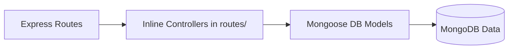
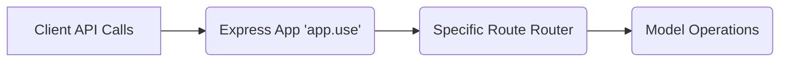
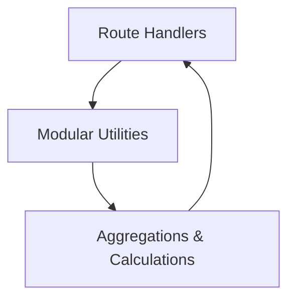

# Backend API and Architecture Documentation

This documentation provides a comprehensive overview of the Strava Clone Backend, including APIs, Routes, Database Models, Utility functions, and their interconnected relationships.

---

## 1. API Endpoints

### Authentication & User (Index Routes)
| Endpoint | Method | Description | Request Parameters | Expected Response | Related Route & Models |
|----------|--------|-------------|--------------------|-------------------|------------------------|
| `/signup` | POST | Register a new user with a local account. | **Body:** `username`, `email`, `profilePicture`, `password` | Success message / Error message | `routes/index.js` -> `User` model |
| `/login` | POST | Log in a user locally. | **Body:** `username`, `password` | Redirects to `/` or `/login` | `routes/index.js` -> `User` model |
| `/auth/google` | GET | Initiates Google OAuth Login. | None | Redirects to Google consent screen | `routes/index.js` -> `User` model |
| `/auth/google/callback` | GET | Callback for Google OAuth. | None | Redirects to dashboard/profile or `/login` | `routes/index.js`, `routes/auth.js` -> `User` model |
| `/logout` | GET | Logs out the currently authenticated user. | None | Redirects to `/` | `routes/index.js` -> None |
| `/getInfo` | GET | Redirect to user dashboard with basic info. | None | Redirects to `/dashboard` | `routes/index.js` -> None |

### User Profile (`routes/profile.js`)
| Endpoint | Method | Description | Request Parameters | Expected Response | Related Route & Models |
|----------|--------|-------------|--------------------|-------------------|------------------------|
| `/profile/me` | GET | Get the logged-in user's profile. | None | JSON containing user profile data | `routes/profile.js` -> `User` model |
| `/profile/me/update` | PATCH | Update the user's profile fields. | **Body:** `username`, `email`, `github`, `bio`, `website`, `isPublic` | JSON with updated profile & success status | `routes/profile.js` -> `User` model |
| `/profile/:username` | GET | View a public user's profile along with their history and streak. | **Path:** `username` **Query:** `page`, `limit` | JSON with public profile, total sessions, streak, and paginated history | `routes/profile.js` -> `User`, `Session`, `Streak` util |

### Projects (`routes/projects.js`)
| Endpoint | Method | Description | Request Parameters | Expected Response | Related Route & Models |
|----------|--------|-------------|--------------------|-------------------|------------------------|
| `/project/create` | POST | Create a new project. | **Body:** `name`, `description` | JSON of newly created project | `routes/projects.js` -> `Project`, `User` models |
| `/project/complete/:id` | PATCH | Mark a specific project as complete. | **Path:** `id` | Success 200 (Empty) | `routes/projects.js` -> `Project` model |
| `/project/update/:id` | PATCH | Update project name or description. | **Path:** `id` **Body:** `name`, `description` | JSON of updated project | `routes/projects.js` -> `Project` model |
| `/project` | GET | Retrieve a paginated list of the user's active projects. | **Query:** `page`, `limit` | JSON with pagination details and projects array | `routes/projects.js` -> `Project` model |
| `/project/:id` | GET | Fetch details of a single active project. | **Path:** `id` | JSON of the project data | `routes/projects.js` -> `Project` model |
| `/project/totalSession` | GET | Get aggregates of total sessions and minutes for all active projects. | None | JSON with aggregated stats array | `routes/projects.js` -> `Project`, `Session` models |
| `/project/:id/delete` | DELETE | Soft delete a project (sets `isActive` to false). | **Path:** `id` | JSON success message | `routes/projects.js` -> `Project`, `Session` models |

### Focus Sessions (`routes/FocusSession.js`)
| Endpoint | Method | Description | Request Parameters | Expected Response | Related Route & Models |
|----------|--------|-------------|--------------------|-------------------|------------------------|
| `/session/start` | POST | Start a new focus session for a project. | **Body:** `projectId`, `tag` | JSON containing new session info | `routes/FocusSession.js` -> `Session`, `Project` models |
| `/session/stop/:id` | PATCH | Stop an active focus session & calculate duration. | **Path:** `id` | JSON of completed session | `routes/FocusSession.js` -> `Session`, `User` models |
| `/session/active` | GET | Fetch the user's current running session. | None | JSON of the active session | `routes/FocusSession.js` -> `Session` model |
| `/session/delete/:id` | DELETE | Delete a specific focus session. | **Path:** `id` | 204 No Content | `routes/FocusSession.js` -> `Session` model |
| `/session/history` | GET | Retrieve paginated history of completed sessions. | **Query:** `page`, `limit` | JSON with pagination and completed sessions array | `routes/FocusSession.js` -> `Session`, `Project` models |

### Statistics (`routes/stats.js`)
| Endpoint | Method | Description | Request Parameters | Expected Response | Related Route & Models |
|----------|--------|-------------|--------------------|-------------------|------------------------|
| `/stats/overview` | GET | Get overview of user's focus stats (total time, averages). | None | JSON with aggregated summary | `routes/stats.js` -> `Session` model |
| `/stats/by-project` | GET | Get statistics grouped per project. | None | JSON array containing stats by project | `routes/stats.js` -> `Session` model |
| `/stats/daily` | GET | Get a breakdown of total time and sessions by date. | None | JSON array grouping sessions by day | `routes/stats.js` -> `Session` model |
| `/stats/streak` | GET | Get the user's current streak, longest streak, and last active date. | None | JSON of streaks and last date | `routes/stats.js` -> `Session`, `User` models |

---

## 2. Routes

*   **`routes/index.js`**
    *   **Path:** `/`, `/login`, `/signup`, `/logout`, `/auth/google...`, `getInfo`
    *   **Handler:** Inline Express Route Handlers & Passport Callbacks.
    *   **API Exposed:** Core Registration and Authentication flow. Uses Google Strategy configuration from `auth.js`.
    *   **Related Models:** `User`

*   **`routes/profile.js`**
    *   **Path:** `/profile/*`
    *   **Handler:** Inline Express Handlers acting as Controllers.
    *   **API Exposed:** User profile updating and viewing details of public profiles.
    *   **Related Models:** `User`, `Session`

*   **`routes/projects.js`**
    *   **Path:** `/project/*`
    *   **Handler:** Inline Express Handlers / Controllers.
    *   **API Exposed:** CRUD operations on Projects.
    *   **Related Models:** `Project`, `Session`

*   **`routes/FocusSession.js`**
    *   **Path:** `/session/*`
    *   **Handler:** Inline Express Handlers / Controllers.
    *   **API Exposed:** Managing Focus Sessions (Start, Stop, History).
    *   **Related Models:** `Session`, `User`

*   **`routes/stats.js`**
    *   **Path:** `/stats/*`
    *   **Handler:** Inline Aggregation Route Handlers.
    *   **API Exposed:** Generates aggregated session statistics and streak data.
    *   **Related Models:** `Session`

---

## 3. Database Models

### Model: `User` (`models/users.js`)
*   **Fields & Data Types:** `name` (String), `username` (String, unique), `isPublic` (Boolean), `googleId` (String), `password` (String), `email` (String), `createdAt` (Date), `totalFocusTime` (Number), `profilePicture` (String), `github` (String), `totalSessions` (Number), `bio` (String), `website` (String).
*   **Relationships:** Core entity. Has many Projects, Sessions, and UserBadges.
*   **Routes Interacting:** Index (Auth), Profile, FocusSession (when updating totals).

### Model: `Project` (`models/projects.js`)
*   **Fields & Data Types:** `name` (String), `createdAt` (Date), `updatedAt` (Date), `description` (String), `isActive` (Boolean), `totalSessions` (Number), `totalMinutes` (Number).
*   **Relationships:**
    *   `userId`: `ObjectId` referencing the `User` model.
    *   One project has many `Sessions`.
*   **Routes Interacting:** Projects, FocusSession.

### Model: `Session` (`models/focSessions.js`)
*   **Fields & Data Types:** `startTime` (Date), `endTime` (Date), `duration` (Number), `status` (String: running, completed, paused), `tag` (Array of Strings).
*   **Relationships:**
    *   `projectId`: `ObjectId` referencing the `Project` model.
    *   `userId`: `ObjectId` referencing the `User` model.
*   **Routes Interacting:** FocusSession, Projects (Aggregation), Stats, Profile.

### Model: `Badge` (`models/badges.js`)
*   **Fields & Data Types:** `name` (String), `icon` (String), `description` (String), `criteria` (Object: {`criteriaType`: String, `count`: Number}), `rarity` (String).
*   **Relationships:** Shared globally across the app. Associated with users via the `UserBadge` model.
*   **Routes Interacting:** None directly via routes, modified securely backend-side or via utilities.

### Model: `UserBadge` (`models/userbadge.js`)
*   **Fields & Data Types:** `earnedAt` (Date).
*   **Relationships:**
    *   `userId`: `ObjectId` referencing the `User` model.
    *   `badgeId`: `ObjectId` referencing the `Badge` model.
*   **Routes Interacting:** Evaluated & used in Utility checks.

---

## 4. Utilities

### Utilities Overview

*   **Utility Name:** `calculateStreak` (`utils/streak.js`)
    *   **Purpose:** Takes a `userId` and calculates the user's current login/focus streak, their longest streak, and last active date by scanning all past completed sessions.
    *   **Where it is used:** Imported and used primarily inside `routes/profile.js` to compute a user's streak when viewing public profiles.

*   **Utility Name:** `checkAndAwardBadges` (`utils/checkAndAwardBadges.js`)
    *   **Purpose:** Checks a user's progress (e.g., total sessions, total minutes, streak) against the Badge requirements and automatically awards new/eligible Badges to the `UserBadge` model.
    *   **Where it is used:** Meant to be triggered independently whenever user statistics change (e.g., post session stopping). *Note: Currently acts as an available modular service, but requires explicit hooks in the FocusSession stops.*

---

## 5. Relationships and Flow

### Flow Between Components
The backend follows a standard Express pattern where defining routes also serves effectively as writing controllers (inline functional handling).

#### Routes → Controllers → Models

*   **Implementation Example:** The `/project/create` route handles the incoming Request, maps the validation and logic (the inherent Controller role), and directly queries the `Project` Model to save the row to the database.

#### APIs → Routes → Models

*   **Implementation Example:**
    1. A frontend makes a `GET` call to `/stats/overview`.
    2. The root `app.js` delegates the request to the `routes/stats.js` modular router.
    3. The `stats.js` router invokes the inline controller function.
    4. The controller runs complex aggregation queries (`$group`, `$match`) on the `Session` DB Model.
    5. Formatted JSON is returned down the chain to the client.

#### Utilities → Routes/Services

*   **Implementation Example:** When the `routes/profile.js` is fetching a public user's feed, it calls the exported `calculateStreak` function from `utils/streak.js`. The utility performs the isolated heavy computation interacting directly with the `Session` Model, avoiding code bloat in the route, and passing the structured result back down to the caller sequence. 
