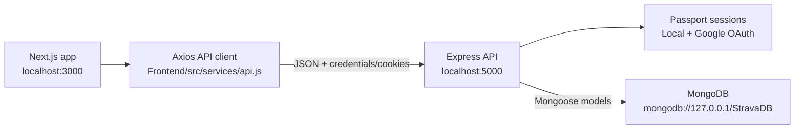
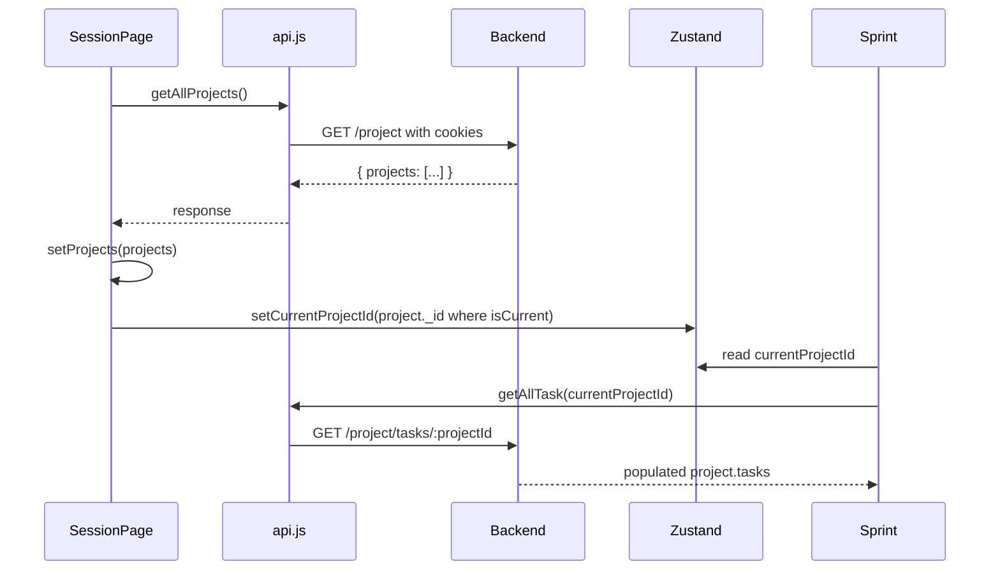

# KARMA

KARMA is a full-stack focus tracking and project productivity application. The current codebase is split into a Next.js frontend and an Express/MongoDB backend. It supports local signup/login, Google OAuth, project creation and selection, project tasks, focus timer UI, profile data, and partially implemented focus-session, stats, badge, and social-follow modules.

This document describes the implementation as it exists in the repository. Some backend modules are present but are not mounted in `Backend/app.js`, and several files contain implementation bugs. Those are documented explicitly in the Known Issues section.

## 1. System Overview

### What the application does

The application is designed around focused work sessions:

- Users register or log in.
- Users create projects.
- One project can be marked as the current project.
- The session dashboard shows the current project, today's tasks, a timer/stopwatch interface, and placeholder activity data.
- Tasks can be created under a project and marked complete.
- Backend modules also intend to support focus sessions, historical stats, badges, public profiles, and social following.

### High-level architecture



The frontend uses the Next.js App Router and client-side React components. API calls are centralized through an Axios instance configured with `baseURL: "http://localhost:5000/"` and `withCredentials: true`, allowing browser cookies to be sent to the Express backend.

The backend is an Express app using:

- `express-session` for server-side sessions.
- `passport` and `passport-local-mongoose` for local username/password login.
- `passport-google-oauth20` for Google OAuth.
- `mongoose` for MongoDB persistence.
- CORS configured for `http://localhost:3000` and `https://hoppscotch.io`.

## 2. Frontend Architecture

### Frontend folder structure

```text
Frontend/
  src/
    app/
      layout.jsx              Root HTML/body layout and metadata
      page.jsx                Default create-next-app landing page
      login/page.jsx          Local login and Google OAuth entry UI
      signup/page.jsx         Local signup and Google OAuth entry UI
      session/page.jsx        Main focus dashboard
    components/
      functional/
        Activity.jsx          Placeholder activity panel
        Navbar.jsx            Top fixed navigation bar
        ProjectSelector.jsx   Project dropdown, creation, current project selection
        Sprint.jsx            Task list for the current project
        Timer.jsx             Switches between timer and stopwatch modes
      ui/
        Countdown-stopwatch.jsx Stopwatch UI logic
        Countdown-timer.jsx     Countdown timer UI logic
        Dropdown.jsx
        Floating-dock.jsx
        Lamp.jsx
        Smooth-cursor.jsx
    services/
      api.js                  Axios client and endpoint wrappers
    store/
      useProjectStore.js      Zustand project selection store
    lib/
      utils.js
```

### Routing system

This frontend uses the Next.js App Router:

- `/` maps to `src/app/page.jsx`. It is still the default Next.js starter page and is not integrated into the product flow.
- `/signup` maps to `src/app/signup/page.jsx`.
- `/login` maps to `src/app/login/page.jsx`.
- `/session` maps to `src/app/session/page.jsx`, the main app screen.

All product pages that use state, effects, event handlers, or browser APIs are client components via `"use client"`.

### Key frontend components

#### `SessionPage`

`Frontend/src/app/session/page.jsx` is the main dashboard. It renders:

- `SmoothCursor`
- `Navbar`
- `Sprint`
- `ProjectSelector`
- `Timer`
- `Activity`
- `FloatingDock`

It owns the `projects` React state:

```js
const [projects, setProjects] = useState([]);
```

On mount, it calls:

```js
api.getAllProjects()
```

and stores `res.data.projects` locally. A second effect watches `projects`, finds the project where `isCurrent === true`, and writes its `_id` into Zustand as `currentProjectId`.

#### `ProjectSelector`

`ProjectSelector` receives `projects` and `setProjects` from `SessionPage`.

Responsibilities:

- Display the current project name by finding `projects.find(p => p.isCurrent === true)`.
- Open/close a dropdown.
- Render all projects returned from the backend.
- Create a new project through `api.createProject(form)`.
- Mark a project as current through `api.updateProject(projectId, { isCurrent: true })`.
- Refetch projects after changing the current project so the UI receives the backend's updated `isCurrent` flags.

When a project is selected:

1. The component calls `PATCH /project/update/:id` with `{ isCurrent: true }`.
2. The backend sets that project to `isCurrent: true`.
3. The backend sets all other projects owned by the user to `isCurrent: false`.
4. The frontend immediately writes the selected id to Zustand.
5. The frontend refetches all projects and replaces the local `projects` array.

#### `Sprint`

`Sprint` reads `currentProjectId` from Zustand:

```js
const currentProjectId = useProjectStore((state) => state.currentProjectId);
```

When `currentProjectId` changes, it fetches tasks with:

```js
api.getAllTask(currentProjectId)
```

The backend response shape is:

```json
{
  "success": true,
  "tasks": {
    "_id": "project id",
    "tasks": [
      {
        "_id": "task id",
        "description": "Task text",
        "isCompleted": false
      }
    ]
  }
}
```

The component therefore reads:

```js
setTasks(res.data.tasks.tasks);
```

Adding a task calls:

```js
api.addNewTask(currentProjectId, { description: newTask })
```

and appends `res.data.task` to local state. Completing a task calls:

```js
api.completeTask(taskId)
```

and updates the matching task object in local state to `isCompleted: true`.

#### `Timer`

`Timer` stores a local `mode` state:

```js
const [mode, setMode] = useState("stopwatch");
```

It renders either:

- `Countdown-stopwatch.jsx`, which counts upward from start time.
- `Countdown-timer.jsx`, which counts down from a selected/custom duration.

Important: the current timer UI does not call the backend session endpoints. Starting, pausing, resetting, and ending sessions are local UI actions only in the frontend.

#### `Login` and `Signup`

The login page posts `{ username, password }` through `api.login(form)`. The signup page posts `{ email, username, password, name }` through `api.signup(form)`.

Both pages include a Google OAuth link:

```html
http://localhost:5000/auth/google
```

OAuth is browser-navigation based rather than Axios based, which is correct for Passport's redirect flow.

### State management

The only global frontend store is `Frontend/src/store/useProjectStore.js`.

It stores:

- `projectId`: a generic project id slot. It is currently not meaningfully used by the main flow.
- `currentProjectId`: the selected/current project id used by `Sprint` to fetch tasks.

Actions:

- `setCurrentProjectId(projectId)`
- `setProjectId(id)`
- `print()`

The store is not persisted. On page refresh, Zustand resets to `null`, and `SessionPage` restores `currentProjectId` by fetching `/project` and locating the project with `isCurrent: true`.

### Frontend data flow



## 3. Backend Architecture

### Backend folder structure

```text
Backend/
  app.js                  Express app setup, middleware, mounted routes
  bin/www                 HTTP server entrypoint, listens on port 5000
  config/db.js            MongoDB connection
  models/
    users.js              User schema + passport-local-mongoose
    projects.js           Project schema
    projectTasks.js       Project task schema
    focSessions.js        Focus session schema
    badges.js             Badge schema
    userbadge.js          User-to-badge join schema
    follows.js            Follow relation schema
    activity.js           Intended activity schema
  routes/
    index.js              Auth, root page, Google OAuth, getInfo
    users.js              Placeholder users route
    projects.js           Project and task routes
    profile.js            Own/public profile routes
    FocusSession.js       Session routes, currently not mounted
    stats.js              Stats routes, currently not mounted
    badge.js              Badge routes, currently not mounted
    follow.js             Social routes, currently not mounted
    auth.js               Google OAuth strategy registration
  utils/
    checkAndAwardBadges.js
    streak.js
```

### Express setup

`Backend/app.js` performs the application bootstrapping:

1. Loads environment variables with `dotenv`.
2. Connects to MongoDB by calling `connectDB()`.
3. Configures CORS:

   ```js
   cors({
     origin: ["http://localhost:3000", "https://hoppscotch.io"],
     methods: ["GET", "POST", "PUT", "PATCH", "DELETE"],
     credentials: true,
   })
   ```

4. Configures `express-session`:

   ```js
   session({
     secret: "your_secret_key",
     resave: false,
     saveUninitialized: false,
     cookie: {
       secure: false,
       httpOnly: true,
       sameSite: "lax",
     },
   })
   ```

5. Sets EJS as the view engine.
6. Registers the local Passport strategy from `user.createStrategy()`.
7. Adds request logging, JSON parsing, URL-encoded parsing, cookie parsing, and static file middleware.
8. Initializes Passport and Passport sessions.
9. Mounts these routers:

   ```js
   app.use("/", indexRouter);
   app.use("/users", usersRouter);
   app.use("/", projectRouter);
   app.use("/", profileRouter);
   ```

Important: `FocusSession.js`, `stats.js`, `badge.js`, and `follow.js` are not mounted in `app.js`, so their endpoints are currently unreachable.

### Authentication flow

Authentication is handled by Passport in two ways.

#### Local username/password

The User schema uses `passport-local-mongoose`:

```js
userSchema.plugin(plm);
```

This plugin adds helpers like:

- `User.register(user, password)`
- `User.createStrategy()`
- `User.serializeUser()`
- `User.deserializeUser()`

Local signup:

1. Frontend calls `POST /signup`.
2. Backend creates a new `User` instance from `name`, `username`, `email`, and `profilePicture`.
3. Backend calls `User.register(newUser, password)`.
4. `passport-local-mongoose` hashes/stores password fields.
5. Backend returns the registered user.

Local login:

1. Frontend calls `POST /login`.
2. `passport.authenticate("local")` validates credentials.
3. On success, Passport serializes the user id into the session.
4. Express session writes the session cookie.
5. Current backend config redirects to `/session` on success and `/signup` on failure.

Because this route is configured with redirects, Axios may receive redirected HTML rather than a clean JSON payload. The frontend currently checks only whether `res.data` exists.

#### Google OAuth

Google OAuth is configured in `Backend/routes/auth.js`, which is loaded by `Backend/routes/index.js` with `require("./auth")`.

The OAuth strategy uses:

- `GOOGLE_CLIENT_ID`
- `GOOGLE_CLIENT_SECRET`
- callback URL `http://localhost:5000/auth/google/callback`

Flow:

1. User clicks the Google link in the frontend.
2. Browser navigates to `GET /auth/google`.
3. Passport redirects to Google with `profile` and `email` scopes.
4. Google redirects back to `/auth/google/callback`.
5. Passport receives the Google profile.
6. Backend looks for `User.findOne({ googleId: profile.id })`.
7. If the user exists, it logs that user in.
8. If not, it creates a user with `googleId`, `username`, `email`, and `profilePicture`.
9. The route saves the session and redirects to `http://localhost:3000/session`.

### Route responsibilities

Mounted routes:

- `routes/index.js`
  - root EJS page
  - local signup/login
  - Google OAuth entry/callback
  - logout
  - `/getInfo`
- `routes/projects.js`
  - project CRUD
  - current project selection
  - project task creation/fetching/completion intent
- `routes/profile.js`
  - current user profile
  - current user profile update
  - public profile lookup
- `routes/users.js`
  - placeholder only

Present but not mounted:

- `routes/FocusSession.js`
- `routes/stats.js`
- `routes/badge.js`
- `routes/follow.js`

## 4. Database Design

### User model: `Backend/models/users.js`

Collection/model name: `user`

Fields:

- `name`: display name.
- `username`: required, trimmed, unique username. Used by local login and public profile lookup.
- `avatar`: alternate avatar field.
- `profilePicture`: image URL, used by Google OAuth creation.
- `isPublic`: boolean, default `true`; public profile route only returns users where this is true.
- `googleId`: Google OAuth profile id.
- `followerCount`: denormalized number, default `0`.
- `followingCount`: denormalized number, default `0`.
- `password`: declared manually, though `passport-local-mongoose` also manages password hash/salt fields.
- `email`: email address.
- `createdAt`: date, default `Date.now`.
- `totalFocusTime`: intended denormalized total focus time.
- `github`: profile link.
- `totalSessions`: intended denormalized session count.
- `bio`: profile biography.
- `website`: lowercased/trimmed website field with a regex URL validator.

Relationships:

- One user owns many projects through `Project.userId`.
- One user owns many focus sessions through `Session.userId`.
- One user can earn many badges through `UserBadge.userId`.
- One user can follow and be followed through `Follow.followerId` and `Follow.followingId`.

### Project model: `Backend/models/projects.js`

Collection/model name: `Project`

Fields:

- `name`: required, trimmed project name.
- `isCurrent`: boolean, default `false`. Used to restore the selected project after refresh.
- `createdAt`: date. The schema also enables `timestamps`, so Mongoose also manages `createdAt` and `updatedAt`.
- `updatedAt`: date, manually set in some routes.
- `color`: project color selected by the frontend color input.
- `type`: project type/category string.
- `description`: project description.
- `userId`: required indexed ObjectId reference to `user`.
- `tasks`: array of ObjectId references to `project_task`.
- `isActive`: boolean soft-delete flag, default `true`.
- `totalSessions`: denormalized count, default `0`.
- `totalMinutes`: denormalized duration, default `0`.

Relationships:

- Belongs to one user.
- Has many tasks through the `tasks` array.
- Intended to have many focus sessions through `Session.projectId`.

Important flags:

- `isCurrent` is the cross-refresh source of truth for the selected project.
- `isActive` is used by list/update/complete flows to hide soft-deleted projects.
- `userId` scopes projects to the authenticated user.

### Project task model: `Backend/models/projectTasks.js`

Collection/model name: `project_task`

Fields:

- `projectId`: ObjectId reference intended to point back to the parent project.
- `description`: required task text.
- `isCompleted`: boolean, default `false`.

Relationships:

- Each task points to a project via `projectId`.
- Each project also stores task ids in its `tasks` array.

The current task schema does not include timestamps, but the route tries to sort populated tasks by `createdAt`. That sort will not be meaningful until timestamps are added.

### Focus session model: `Backend/models/focSessions.js`

Collection/model name: `session`

Fields:

- `startTime`: date, default `Date.now`.
- `endTime`: date.
- `duration`: number, intended to store minutes.
- `projectId`: required ObjectId reference to a project.
- `status`: enum of `running`, `completed`, `paused`, `cancelled`, default `running`.
- `tag`: string array.
- `userId`: required indexed ObjectId reference to `user`.

Relationships:

- Belongs to one user.
- Belongs to one project.

Important caveat: `projectId.ref` is `"project"`, but the Project model is registered as `"Project"`. Mongoose refs are model-name sensitive, so population may fail unless the ref is corrected.

### Badge model: `Backend/models/badges.js`

Collection/model name: `Badge`

Fields:

- `name`: required, trimmed badge name.
- `icon`: icon string.
- `description`: badge description.
- `criteria.criteriaType`: enum of `sessions`, `minutes`, `projects`, `streak`.
- `criteria.count`: required threshold number.
- `rarity`: enum of `common`, `rare`, `epic`, `legendary`, default `common`.

### UserBadge model: `Backend/models/userbadge.js`

Intended collection/model name: `UserBadge`

Fields:

- `userId`: required indexed ObjectId reference to `user`.
- `badgeId`: required ObjectId reference to `Badge`.
- `earnedAt`: date, default `Date.now`.

Important caveat: this file uses `mongoose.Schema` but does not import `mongoose`, so requiring it will throw until fixed.

### Follow model: `Backend/models/follows.js`

Intended collection/model name: `follow`

Fields:

- `followerId`: ObjectId reference to `user`.
- `followingId`: ObjectId reference to `user`.

Important caveat: the file uses `mongoose.createConnection({...})` where it should use `new mongoose.Schema({...})`. The later `followSchema.index(...)` call assumes a schema, so this model is currently broken.

### Activity model: `Backend/models/activity.js`

Intended collection/model name: `activity`

Fields:

- `userId`
- `actType`
- `metadata`
- `createdAt`

Important caveat: this file also uses `mongoose.createConnection({...})` instead of `new mongoose.Schema({...})`, so it is not a valid schema implementation.

## 5. API Layer

### Frontend API wrapper

`Frontend/src/services/api.js` creates one Axios client:

```js
const apiClient = axios.create({
  baseURL: "http://localhost:5000/",
  withCredentials: true,
});
```

`withCredentials: true` is essential because the backend uses cookie-based Passport sessions. Without it, authenticated routes would receive no session cookie and would return `401`.

The response interceptor logs `"Session Expired"` for `401` responses but does not redirect or clear frontend state.

### Mounted backend endpoints

These endpoints are reachable through the current `app.js`.

#### Auth

`POST /signup`

Request:

```json
{
  "name": "Ada Lovelace",
  "username": "ada",
  "email": "ada@example.com",
  "password": "secret"
}
```

Response:

```json
{
  "message": "User registered successfully!",
  "user": { "...": "registered user document" }
}
```

`POST /login`

Request:

```json
{
  "username": "ada",
  "password": "secret"
}
```

Behavior:

- Uses `passport.authenticate("local")`.
- Redirects to `/session` on success.
- Redirects to `/signup` on failure.
- Creates a session cookie on success.

`GET /auth/google`

Starts the Google OAuth redirect flow.

`GET /auth/google/callback`

Completes OAuth, creates/fetches the user, saves the session, and redirects to `http://localhost:3000/session`.

`GET /logout`

Logs out through `req.logout()` and redirects to `/`.

`GET /getInfo`

Requires auth. Returns:

```json
{
  "user": { "...": "req.user" }
}
```

#### Profile

`GET /profile/me`

Requires auth. Fetches the current user by `req.user._id`.

Response:

```json
{
  "success": true,
  "data": { "...": "user document" }
}
```

`PATCH /profile/me/update`

Requires auth. Intended to update selected profile fields:

- `username`
- `email`
- `github`
- `bio`
- `website`
- `isPublic`

The route intends to check duplicate email and username values before update.

Important caveat: the route imports `userSchema` but uses `User.findOne` and `User.findByIdAndUpdate`, where `User` is not defined. It also references `profile` and `isPublic` variables incorrectly. This endpoint is currently likely to fail.

`GET /profile/:username`

Requires auth. Finds a public user by username, then returns profile fields, paginated session history, and streak data.

Important caveat: the route imports `streak` but calls `Streak(...)`, so this endpoint is currently likely to fail.

#### Projects

`POST /project/create`

Requires auth.

Request:

```json
{
  "name": "KARMA",
  "description": "Build the productivity app",
  "color": "#3882F6",
  "type": "Full Stack"
}
```

Behavior:

1. Validates `name` is non-empty.
2. Checks for an existing project with the same `name` owned by the current user.
3. Creates a project with `userId: req.user._id`.
4. Returns the created project.

Response:

```json
{
  "newProject": {
    "_id": "...",
    "name": "KARMA",
    "isCurrent": false,
    "isActive": true
  }
}
```

`GET /project`

Requires auth.

Query params:

- `page`, default `1`
- `limit`, default `10`, capped at `50`

Behavior:

1. Filters by `{ userId: req.user._id, isActive: true }`.
2. Sorts by newest first.
3. Selects project display/stat fields.
4. Returns pagination metadata and projects.

Response:

```json
{
  "success": true,
  "currentPage": 1,
  "totalPages": 1,
  "totalProjects": 2,
  "projects": [
    {
      "_id": "...",
      "name": "KARMA",
      "description": "Build the productivity app",
      "color": "#3882F6",
      "type": "Full Stack",
      "isCurrent": true,
      "totalSessions": 0,
      "totalMinutes": 0,
      "createdAt": "..."
    }
  ]
}
```

`PATCH /project/update/:id`

Requires auth.

Request:

```json
{
  "name": "Updated name",
  "description": "Updated description",
  "type": "Backend",
  "color": "#00ff00",
  "isCurrent": true
}
```

Behavior:

1. Finds an active project owned by the current user with `_id = :id`.
2. Updates provided fields.
3. If `isCurrent === true`, sets this project to current.
4. Sets `isCurrent: false` on all other projects owned by the user.
5. Saves and returns the updated project.

Response:

```json
{
  "success": true,
  "data": { "...": "updated project" }
}
```

`PATCH /project/complete/:id`

Requires auth. Finds an active project and sets `isActive = false`.

Important caveat: on success, this route currently saves but does not send a response, so clients may hang.

`GET /project/:id`

Requires auth. Intended to validate an ObjectId, fetch one active project, and return selected fields.

Important caveat: `mongoose` is not imported in `routes/projects.js`, so ObjectId validation will throw.

`GET /project/totalSession`

Requires auth. Intended to aggregate completed sessions per project using `$lookup` from `sessions`.

Important caveat: this route is declared after `GET /project/:id`. Express will match `/project/totalSession` as if `"totalSession"` were an `:id`, so this endpoint is shadowed by the dynamic route.

`DELETE /project/:id/delete`

Requires auth. Intended to soft-delete a project unless it has a running session.

Important caveats:

- `mongoose` is not imported.
- `findOneAndUpdate` is called without an update object.
- `project.isActive = false` is set but not saved.

#### Project tasks

`POST /project/AddTask/:projectId`

Requires auth.

Request:

```json
{
  "description": "Write README"
}
```

Behavior:

1. Creates a `project_task` document with `description` and `projectId`.
2. Pushes the task id into the parent project's `tasks` array.
3. Returns the new task.

Response:

```json
{
  "success": true,
  "task": {
    "_id": "...",
    "projectId": "...",
    "description": "Write README",
    "isCompleted": false
  }
}
```

`GET /project/tasks/:projectId`

Requires auth.

Behavior:

1. Finds the project by `_id`.
2. Populates the project's `tasks` array.
3. Returns the project document with populated tasks.

Response:

```json
{
  "success": true,
  "tasks": {
    "_id": "...",
    "tasks": [
      {
        "_id": "...",
        "description": "Write README",
        "isCompleted": false
      }
    ]
  }
}
```

Important caveat: this route does not verify that the project belongs to `req.user._id`.

`PATCH /project/checkTask/:taskId`

Requires auth. Intended to mark an incomplete task as complete.

Important caveat: the route uses `projTask`, but the imported model is named `project_task`. This endpoint will currently throw until the variable name is fixed.

`PATCH /project/uncheckTask/:taskId`

Requires auth. Intended to mark a complete task as incomplete.

Important caveat: it also uses undefined `projTask`.

`DELETE /project/DeleteTask/:taskId/:projectId`

Requires auth. Intended to delete a task and pull its id from the project.

Important caveat: it also uses undefined `projTask`.

### Present but currently unmounted endpoints

The frontend API wrapper includes session methods:

- `POST /session/start`
- `GET /session/active`
- `GET /session/history`

The backend has routes for those in `routes/FocusSession.js`, but `app.js` does not mount that router. The same is true for:

- `/stats/*`
- `/badges*`
- `/social/*`

Until the routers are imported and mounted in `app.js`, requests to those endpoints will return 404.

## 6. Core System Flows

### User signup

Step 1 -> User opens `/signup`.

Step 2 -> `signup/page.jsx` stores form values in local React state:

```js
{
  email: "",
  username: "",
  password: "",
  name: ""
}
```

Step 3 -> On submit, the page calls:

```js
api.signup(form)
```

Step 4 -> `api.js` posts to `POST /signup` with cookies enabled.

Step 5 -> Backend creates a new `User` and calls `User.register(newUser, password)`.

Step 6 -> Backend returns a success payload.

Step 7 -> Frontend runs a short animation and routes to `/session`.

Important detail: signup does not automatically log the user in in the backend route. The frontend redirects to `/session`, but authenticated calls from that page may still fail if no session was created.

### User login

Step 1 -> User opens `/login`.

Step 2 -> `login/page.jsx` stores `username` and `password` in local state.

Step 3 -> On submit, frontend calls:

```js
api.login(form)
```

Step 4 -> Backend runs `passport.authenticate("local")`.

Step 5 -> If credentials are valid, Passport serializes the user into the server-side session and Express sends a session cookie.

Step 6 -> Backend redirects to `/session`.

Step 7 -> Frontend sees a response and routes to `/`.

Important detail: the backend success redirect is `/session`, but the frontend manually pushes `/`. This creates inconsistent post-login navigation.

### Google OAuth login

Step 1 -> User clicks the Google OAuth link.

Step 2 -> Browser navigates to `http://localhost:5000/auth/google`.

Step 3 -> Passport redirects to Google.

Step 4 -> User authenticates with Google.

Step 5 -> Google redirects to `http://localhost:5000/auth/google/callback`.

Step 6 -> Backend's Google strategy receives the profile.

Step 7 -> Backend finds or creates a user using `googleId`.

Step 8 -> Passport serializes the user into the session.

Step 9 -> Backend saves the session and redirects to `http://localhost:3000/session`.

Step 10 -> `/session` fetches projects using the new cookie-backed session.

### Fetching user profile

Step 1 -> Frontend calls:

```js
api.getProfile()
```

Step 2 -> Axios sends `GET /profile/me` with the session cookie.

Step 3 -> Backend `isloggedIn` checks `req.isAuthenticated()`.

Step 4 -> If authenticated, backend fetches:

```js
userSchema.findById(req.user._id)
```

Step 5 -> Backend returns `{ success: true, data: profile }`.

Step 6 -> Frontend can render profile data.

If the session is missing or expired, backend returns `401`, and the Axios response interceptor logs `"Session Expired"`.

### Fetching projects

Step 1 -> `/session` mounts.

Step 2 -> `SessionPage` calls `api.getAllProjects()`.

Step 3 -> Axios sends `GET /project` with credentials.

Step 4 -> Backend filters projects by:

```js
{
  userId: req.user._id,
  isActive: true
}
```

Step 5 -> Backend sorts by `createdAt: -1`, applies pagination, and selects display fields.

Step 6 -> Backend returns `projects`.

Step 7 -> `SessionPage` calls:

```js
setProjects(res.data.projects)
```

Step 8 -> React rerenders `ProjectSelector`.

### Selecting a project and `isCurrent` logic

Step 1 -> User opens the project dropdown.

Step 2 -> User clicks the check area for a project.

Step 3 -> `ProjectSelector.setIsCurrent(projectId)` runs.

Step 4 -> Frontend calls:

```js
api.updateProject(projectId, { isCurrent: true })
```

Step 5 -> Backend finds the project where:

```js
{
  userId: req.user._id,
  isActive: true,
  _id: req.params.id
}
```

Step 6 -> Backend sets the selected project's `isCurrent` to `true`.

Step 7 -> Backend runs `Project.updateMany` for the same user where `_id` is not the selected id and sets `isCurrent` to `false`.

Step 8 -> Backend saves the selected project.

Step 9 -> Frontend writes the selected id into Zustand:

```js
setCurrentProjectId(projectId)
```

Step 10 -> Frontend refetches all projects.

Step 11 -> `projects` state updates, causing `ProjectSelector` to show the new current project.

Step 12 -> `SessionPage`'s project watcher also finds the current project and writes the id into Zustand again.

### Page refresh behavior

Step 1 -> Browser refreshes `/session`.

Step 2 -> All React local state is lost.

Step 3 -> Zustand store is recreated with:

```js
currentProjectId: null
```

Step 4 -> `SessionPage` mounts and fetches `/project`.

Step 5 -> Backend returns active projects, including `isCurrent`.

Step 6 -> `SessionPage` finds:

```js
projects.find(p => p.isCurrent)
```

Step 7 -> If found, `setCurrentProjectId(currentProject._id)` restores the selected project.

Step 8 -> `Sprint` observes the restored id and fetches tasks.

This is why `isCurrent` exists in the database: it is the durable source of truth for the user's selected project across reloads.

### Fetching tasks for a project

Step 1 -> `Sprint` reads `currentProjectId` from Zustand.

Step 2 -> The `useEffect` in `Sprint` exits early if `currentProjectId` is missing.

Step 3 -> Once a current project id exists, it calls:

```js
api.getAllTask(currentProjectId)
```

Step 4 -> Backend finds the project by id and populates `tasks`.

Step 5 -> Backend returns the project document under `tasks`.

Step 6 -> Frontend extracts:

```js
res.data.tasks.tasks
```

Step 7 -> `Sprint` stores that array in local `tasks` state and renders each task.

### Creating a task

Step 1 -> User types into the "Add Task" input.

Step 2 -> `Sprint` stores the input in `newTask`.

Step 3 -> User submits the form.

Step 4 -> `Sprint.addNewTask` prevents empty tasks with:

```js
if (!newTask.trim()) return;
```

Step 5 -> Frontend calls:

```js
api.addNewTask(currentProjectId, { description: newTask })
```

Step 6 -> Backend creates a `project_task` document.

Step 7 -> Backend pushes the task id into `Project.tasks`.

Step 8 -> Backend returns `{ success: true, task }`.

Step 9 -> Frontend appends `task` to local `tasks` state.

Step 10 -> Frontend clears `newTask`.

### Completing a task

Step 1 -> User clicks the task completion button.

Step 2 -> `Sprint.completeTask(taskId)` calls:

```js
api.completeTask(taskId)
```

Step 3 -> API wrapper sends:

```http
PATCH /project/checkTask/:taskId
```

Step 4 -> Intended backend behavior is to find a task where `_id = taskId` and `isCompleted = false`, then set `isCompleted = true`.

Step 5 -> Intended response is:

```json
{
  "success": true,
  "task": { "...": "updated task" }
}
```

Step 6 -> Frontend maps over local `tasks` and changes only the matching task to `isCompleted: true`.

Current issue: this route uses an undefined `projTask` variable, so completing tasks will fail until fixed.

### Starting and stopping focus sessions

The backend has intended routes for sessions in `routes/FocusSession.js`, and the frontend API wrapper has methods for them. However:

- The session router is not mounted in `Backend/app.js`.
- The timer UI does not call `api.startSession`, `api.currentSessionInfo`, or a stop-session API.

Intended start flow:

1. Frontend calls `POST /session/start` with `{ projectId, tag }`.
2. Backend checks if the user already has a running session.
3. Backend creates a session with `status: "running"` and `startTime: new Date()`.
4. Backend returns the session.

Intended stop flow:

1. Frontend calls `PATCH /session/stop/:id`.
2. Backend finds the running session.
3. Backend sets `endTime`, `status: "completed"`, and calculates `duration`.
4. Backend increments the user's `totalSessions`.
5. Backend checks badges.
6. Backend returns the completed session and any rewards.

Current issue: the stop route treats `:id` as a user id, not a session id, and badge checking references undefined values.

## 7. State Management Strategy

### What is stored in Zustand

`useProjectStore` stores only project-selection identifiers:

- `currentProjectId`: consumed by `Sprint`.
- `projectId`: currently unused in the main dashboard flow.

### What is stored locally

Most UI data is stored in component state:

- `SessionPage.projects`: project list returned by `/project`.
- `ProjectSelector.form`: create-project form.
- `ProjectSelector.dropdown`: dropdown open/closed state.
- `ProjectSelector.CreateForm`: whether the create-project form is visible.
- `Sprint.tasks`: populated task list for current project.
- `Sprint.newTask`: add-task input value.
- `Timer.mode`: `timer` or `stopwatch`.
- Timer components: start/pause/reset timing values.
- Login/signup forms: local input values.

### Derived vs stored state

Derived:

- Current project object is derived from `projects.find(p => p.isCurrent)`.
- Task completion display is derived from each task's `isCompleted`.
- Timer display values are derived from timestamps/duration state.

Stored:

- `currentProjectId` is stored globally because multiple components need the selected project id.
- `projects` is stored locally in `SessionPage` because it is fetched data owned by the dashboard.
- `tasks` is stored locally in `Sprint` because only the sprint panel currently uses it.

### Why `currentProjectId` exists

`currentProjectId` is the frontend's immediate pointer to the active project. It prevents components like `Sprint` from needing to know about the full project list. The durable version of that same idea is `Project.isCurrent` in MongoDB.

### Common pitfalls

- Zustand is not persisted, so never assume `currentProjectId` survives refresh.
- The frontend must refetch projects after changing `isCurrent`, because the backend mutates multiple projects.
- If no project has `isCurrent: true`, `Sprint` will not fetch tasks.
- `projectId` and `currentProjectId` can become confusing because both exist. The code currently relies on `currentProjectId`.
- `setIsSelected` in `ProjectSelector` is not used to render meaningful UI state.
- The frontend stores tasks optimistically after create/complete, but there is no full refetch after completion.

## 8. Data Synchronization

### How frontend state syncs with backend

The app uses fetch-on-mount and targeted local updates:

- Projects are fetched when `/session` mounts.
- Current project selection is saved to the backend via `PATCH /project/update/:id`.
- Project list is refetched after project selection.
- Tasks are fetched whenever `currentProjectId` changes.
- New tasks are appended locally after the backend confirms creation.
- Completed tasks are updated locally after the backend confirms completion.

### Where inconsistencies can occur

- Signup redirects to `/session` without logging in, so project fetch may return `401`.
- Local login uses backend redirects, which do not match the frontend's expected JSON-style flow.
- Completing a task currently fails because the backend uses undefined `projTask`.
- Task fetch does not check project ownership, so a user could potentially access another project's tasks by id.
- Project deletion and completion routes have missing/incomplete responses or saves.
- If two browser tabs select different current projects, the last backend update wins. The other tab will not know until it refetches.
- Timer UI is not synchronized with backend sessions, so local timer state and persisted session state can diverge.
- Backend denormalized fields like `Project.totalSessions`, `Project.totalMinutes`, and `User.totalFocusTime` are not consistently updated.

### How state is restored on refresh

Refresh restoration depends on:

1. Browser preserving the session cookie.
2. `/session` refetching `/project`.
3. One project in the database having `isCurrent: true`.
4. `SessionPage` writing that project's `_id` into Zustand.
5. `Sprint` fetching tasks for the restored id.

If the backend has no current project, the UI displays "Select a current project" and the sprint task list does not load.

## 9. Known Issues / Weaknesses

### Routing and mounting issues

- `FocusSession.js`, `stats.js`, `badge.js`, and `follow.js` are not mounted in `Backend/app.js`.
- `GET /project/totalSession` is shadowed by `GET /project/:id` because the dynamic route is declared first.
- `POST /login` returns redirects instead of a JSON API response, which does not fit the frontend Axios flow.

### Backend runtime errors

- `routes/projects.js` uses `mongoose` but does not import it.
- `routes/projects.js` uses `projTask`, but the imported model variable is `project_task`.
- `routes/profile.js` imports `userSchema` but references `User`.
- `routes/profile.js` references `profile`, `isPublic`, and `Streak` incorrectly.
- `routes/FocusSession.js`, `routes/stats.js`, `routes/badge.js`, and `routes/follow.js` use `express.Router()` without importing `express`.
- Several files require `"../models/Badge"` while the actual file is `badges.js`. This can break in case-sensitive environments.
- `models/userbadge.js` uses `mongoose` without importing it.
- `models/activity.js` and `models/follows.js` use `mongoose.createConnection` instead of `new mongoose.Schema`.
- `utils/checkAndAwardBadges.js` defines `checkAndAwardBadges` but does not export it.

### Data model and relationship issues

- `Session.projectId` uses `ref: "project"`, but the model is registered as `"Project"`.
- `projectTasks.projectId` uses `ref: "projects"`, but the model is registered as `"Project"`.
- `Project` defines `createdAt` and `updatedAt` manually while also enabling `timestamps`.
- Tasks are sorted by `createdAt`, but the task schema does not define timestamps.
- Project task routes do not consistently verify project ownership.

### API behavior issues

- `PATCH /project/complete/:id` does not send a success response.
- `DELETE /project/:id/delete` does not save `isActive = false`.
- `DELETE /project/:id/delete` calls `findOneAndUpdate` without an update object.
- `POST /project/AddTask/:projectId` does not validate that the project exists or belongs to the current user.
- `GET /project/tasks/:projectId` does not handle a missing project before returning `allTasks`.
- Session stop route uses `req.params.id` as a user id, not a session id.
- Badge utility expects a stats object but session and stats routes pass incompatible values.

### Frontend issues

- `/` is still the default Next.js starter page.
- Login success pushes `/`, while OAuth success redirects to `/session`.
- The timer UI does not create or stop backend sessions.
- The frontend exposes a GitHub auth button, but no GitHub OAuth backend route exists.
- `Sprint` imports unused modules and an internal Next.js helper.
- `api.addNewTask` accepts `description` but actually sends whatever object the caller passes. The current caller passes `{ description: newTask }`, so it works, but the function signature is misleading.
- `api.getAllTask(projectId, data)` passes `data` to `axios.get`, but GET request bodies are not used. This parameter is unnecessary.

## 10. Improvements & Recommendations

### Simplify backend routing

Import and mount every intended router explicitly:

```js
const focusSessionRouter = require("./routes/FocusSession");
const statsRouter = require("./routes/stats");
const badgeRouter = require("./routes/badge");
const followRouter = require("./routes/follow");

app.use("/", focusSessionRouter);
app.use("/", statsRouter);
app.use("/", badgeRouter);
app.use("/", followRouter);
```

Move static routes above dynamic routes:

```js
router.get("/project/totalSession", ...);
router.get("/project/:id", ...);
```

### Standardize API responses

Use JSON for API endpoints instead of redirects for frontend-consumed routes:

```json
{
  "success": true,
  "data": { "user": "..." }
}
```

For auth failures:

```json
{
  "success": false,
  "error": "Invalid username or password"
}
```

Then let the frontend decide navigation.

### Fix model names and refs

Use consistent model names:

- `mongoose.model("User", userSchema)`
- `mongoose.model("Project", projectSchema)`
- `mongoose.model("ProjectTask", projectTaskSchema)`
- `mongoose.model("Session", focSessionSchema)`

Then update all refs to match exactly:

```js
ref: "Project"
ref: "User"
ref: "ProjectTask"
```

### Improve project selection state

The current `isCurrent` strategy works for refresh restoration, but it stores UI preference in every project document. A cleaner option is storing one field on the user:

```js
currentProjectId: { type: ObjectId, ref: "Project" }
```

Benefits:

- No need to update many project documents.
- No risk of multiple projects having `isCurrent: true`.
- Refresh restoration becomes a direct user-profile read.

If keeping `Project.isCurrent`, add a database-level or transaction-based guarantee that only one active project per user can be current.

### Integrate timer UI with session API

Recommended focus-session flow:

1. User presses Start.
2. Frontend requires `currentProjectId`.
3. Frontend calls `POST /session/start`.
4. Backend returns persisted session id and `startTime`.
5. Frontend timer displays elapsed time based on backend `startTime`.
6. On refresh, frontend calls `GET /session/active`.
7. If an active session exists, frontend restores the timer from `startTime`.
8. User presses End.
9. Frontend calls `PATCH /session/stop/:sessionId`.
10. Backend calculates duration and returns completed session.

The backend, not the browser, should remain the source of truth for persisted session duration.

### Strengthen security and ownership checks

Every project/task/session route should scope by authenticated user:

- Fetch tasks only through a project where `userId: req.user._id`.
- Complete/delete tasks only if their project belongs to the user.
- Start sessions only for projects owned by the user.
- Do not trust `projectId` from the request body without ownership validation.

### Add validation

Add validation for:

- Project id format.
- Task id format.
- Required task descriptions.
- Project ownership.
- Duplicate project names with case-insensitive matching.
- Profile update fields.

Consider a validation library such as Zod or Joi for consistent request validation.

### Improve frontend data fetching

The current manual fetch/state pattern works for a small app. As the app grows, consider TanStack Query or SWR for:

- caching
- refetching
- loading states
- error states
- mutation invalidation
- multi-tab consistency

Example improvement:

- Query key: `["projects"]`
- Mutation: `selectProject(projectId)`
- On success: invalidate `["projects"]` and `["tasks", projectId]`

### Add tests

Highest-value backend tests:

- Authenticated/unauthenticated project access.
- Creating duplicate project names.
- Selecting a current project clears other current flags.
- Adding tasks only to owned projects.
- Completing tasks only under owned projects.
- Starting only one running session per user.
- Refresh restoration behavior through `GET /project`.

Highest-value frontend tests:

- `/session` fetches projects and restores current project.
- Selecting a project updates Zustand and visible project name.
- Creating a task appends it to the sprint list.
- Completing a task updates the UI.

## Development Setup

### Backend

```bash
cd Backend
npm install
npm start
```

The backend listens on port `5000` by default and connects to:

```text
mongodb://127.0.0.1/StravaDB
```

Required environment variables for Google OAuth:

```text
GOOGLE_CLIENT_ID=...
GOOGLE_CLIENT_SECRET=...
```

### Frontend

```bash
cd Frontend
npm install
npm run dev
```

The frontend runs on:

```text
http://localhost:3000
```

The API client expects the backend at:

```text
http://localhost:5000
```

## Where to Debug Common Problems

### Project list is empty

Check:

- Is the user authenticated?
- Did `GET /project` return `401`?
- Is the session cookie being sent? `withCredentials` must be true.
- Does MongoDB have projects with `userId = req.user._id` and `isActive = true`?

### Current project disappears after refresh

Check:

- Does any project for the user have `isCurrent: true`?
- Did `/session` successfully fetch `/project`?
- Did `SessionPage` run the effect that calls `setCurrentProjectId`?

### Tasks do not load

Check:

- Is `currentProjectId` non-null in Zustand?
- Did `GET /project/tasks/:projectId` return a project with a populated `tasks` array?
- Is the frontend expecting `res.data.tasks.tasks`?

### Completing a task fails

The backend route currently references `projTask`, which is undefined. Fix `routes/projects.js` to use the imported project task model consistently.

### Session endpoints return 404

`routes/FocusSession.js` is not mounted in `app.js`. Import it and call `app.use("/", focusSessionRouter)`.

### Google login fails

Check:

- `GOOGLE_CLIENT_ID` and `GOOGLE_CLIENT_SECRET` exist.
- Google console callback URL matches `http://localhost:5000/auth/google/callback`.
- Backend is running on port `5000`.
- Frontend is running on port `3000`.
- Browser accepts the session cookie.
